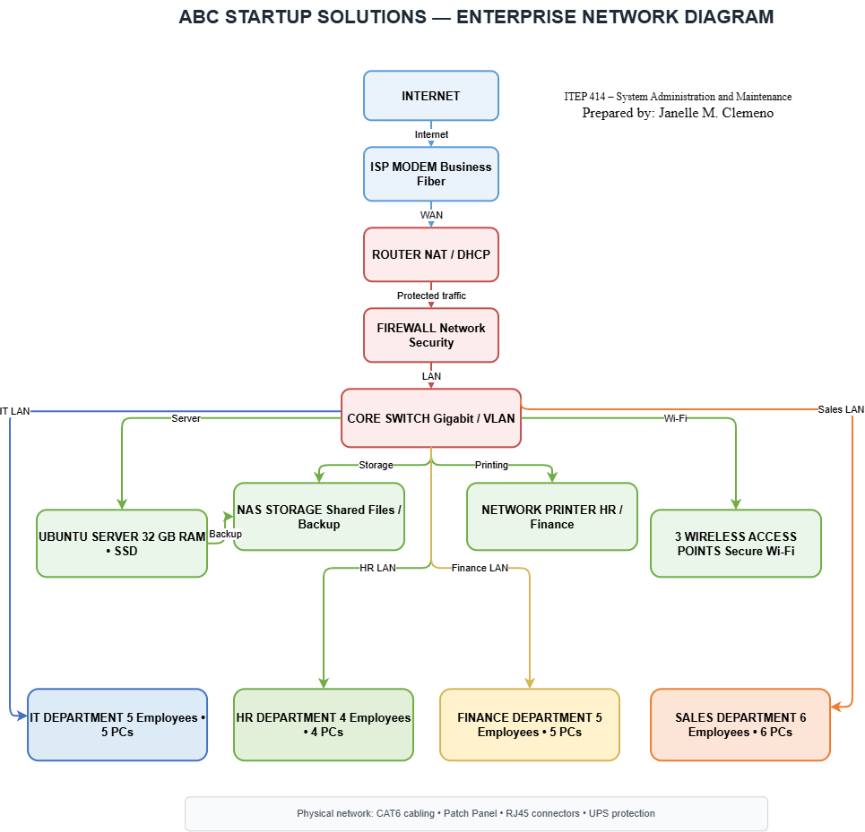

# 🖥️ Enterprise Infrastructure Plan
### ABC Startup Solutions

> **ITEP 414 – System Administration and Maintenance**  
> **Bachelor of Science in Information Technology**  
> **Prepared by:** Janelle M. Clemeno  
> **Week:** 2  
> **Project Type:** Individual Portfolio Project

---

## 📌 Project Overview

This project presents an Enterprise Infrastructure Plan for ABC Startup Solutions, a newly established software development company with 20 employees. The project focuses on planning the company's hardware, software, network infrastructure, system administration roles, security, backup strategy, and future expansion. The goal is to create a reliable, secure, organized, and scalable IT environment before the company begins purchasing and deploying its technology resources.

---

## 🎯 Learning Objectives

Through this project, I developed my understanding of system administration and enterprise infrastructure planning. The project allowed me to:

- Explain the roles and responsibilities of System Administrators.
- Identify hardware, software, and networking requirements for a small business.
- Prepare professional IT inventories.
- Design an enterprise network topology.
- Create technical documentation using Markdown.
- Analyze organizational IT requirements.
- Present infrastructure planning in a professional manner.

---

## 🏢 Company Scenario

ABC Startup Solutions is a newly established software development company operating on a single office floor. The company has **20 employees** distributed across four departments: Information Technology, Human Resources, Finance, and Sales.

| Department | Employees |
|------------|-----------|
| 💻 Information Technology | 5 |
| 👥 Human Resources | 4 |
| 💰 Finance | 5 |
| 📈 Sales | 6 |
| **Total** | **20** |

The company is starting from scratch and currently has no computers, server, network, internet infrastructure, or security policies. As the assigned Junior System Administrator, I prepared the infrastructure plan needed before equipment and services are deployed.

---

## 🖥️ Hardware Inventory Summary

The proposed hardware infrastructure is designed to provide employees with the equipment needed for daily operations while supporting networking, storage, security, and backup requirements.

| Hardware | Quantity | Purpose |
|----------|----------|---------|
| Desktop Computers | 20 | Primary workstations for employees |
| Laptops | 4 | Mobile work and administrative use |
| Ubuntu Server | 1 | Centralized server services |
| Router | 1 | Network routing and internet connectivity |
| Managed Switch | 1 | Central connection for internal devices |
| Network Printer | 1 | Shared printing for departments |
| UPS | 5 | Power protection for critical equipment |
| Wireless Access Points | 3 | Wireless network coverage |
| NAS Storage | 1 | Shared file storage and backup |
| External Backup Drives | 2 | Additional data backup |
| Monitors | 20 | Displays for desktop workstations |

The hardware selections are intended to provide sufficient resources for the company's current 20 employees while allowing room for future expansion.

---

## 💿 Software Inventory Summary

The proposed software environment provides operating systems, productivity applications, development tools, security software, and system administration utilities.

| Software | Purpose |
|----------|---------|
| Windows 11 Pro | Operating system for company workstations |
| Ubuntu Server | Server operating system |
| Microsoft 365 | Productivity and office applications |
| Visual Studio Code | Software development and programming |
| Git | Version control |
| GitHub Desktop | Graphical Git management |
| VirtualBox | Virtual machine management |
| Google Chrome | Web browsing and online services |
| Microsoft Defender | Endpoint and malware protection |
| AnyDesk | Remote technical support |
| 7-Zip | File compression and extraction |

---

## 🌐 Network Infrastructure

The proposed network uses a **hierarchical star topology**, with the core switch serving as the central connection point for the internal network. Internet traffic passes through the ISP modem, router, and firewall before reaching the internal network. The core switch then connects the server, NAS storage, printer, wireless access points, and departmental networks.

### Network Components

- Internet
- ISP Modem
- Router
- Firewall
- Core Switch
- Ubuntu Server
- NAS Storage
- Network Printer
- 3 Wireless Access Points
- IT Department
- HR Department
- Finance Department
- Sales Department
- CAT6 Cabling
- Patch Panel
- RJ45 Connectors

---

## 🗺️ Embedded Enterprise Network Diagram

The following diagram presents the proposed network topology of ABC Startup Solutions and shows how the Internet, network equipment, servers, storage, wireless access points, and departments are connected.



**Figure 1.** ABC Startup Solutions – Enterprise Network Diagram

**Diagram Title:** ABC Startup Solutions – Enterprise Network Diagram  
**Designed by:** Janelle M. Clemeno  
**Tool:** Draw.io / diagrams.net  
**Topology:** Hierarchical Star Topology  
**Editable File:** `Diagrams/Network_Topology.drawio`  
**Exports:** PNG and PDF

---

## 👨‍💻 System Administration Roles

The project covers four important System Administration roles that work together to maintain the company's IT environment.

### 🛠️ Helpdesk Technician

The Helpdesk Technician provides technical assistance to employees by troubleshooting computer, software, and basic IT problems. The role also involves documenting issues, assisting users, configuring devices, and helping maintain smooth daily operations.

### 🌐 Network Administrator

The Network Administrator manages the company's network infrastructure, including routers, switches, firewalls, wireless access points, and connectivity. The role ensures that the network remains reliable, secure, and available to employees.

### 🐧 Linux System Administrator

The Linux System Administrator manages the company's Linux-based server environment. The role includes server configuration, user and permission management, updates, monitoring, troubleshooting, and maintaining server security.

### ☁️ Cloud Administrator

The Cloud Administrator manages cloud-based services and resources used by the organization. The role includes managing cloud storage, virtual machines, user access, configurations, and cloud security.

These four professionals work together to keep the company's technology environment reliable and secure. The Helpdesk Technician supports employees directly, while the Network Administrator manages connectivity, the Linux System Administrator maintains server resources, and the Cloud Administrator manages cloud-based services. Their collaboration helps ensure that technical problems are resolved efficiently and that company systems remain available.

---

## 🔐 Infrastructure Recommendations

### 🌐 Internet Provider

ABC Startup Solutions should use a reliable business fiber internet connection to support cloud services, online applications, communication, and daily business operations.

### 🖥️ Server Specifications

A dedicated Ubuntu Server with sufficient RAM, processing power, and SSD storage is recommended to support centralized company services and future growth.

### 💾 Backup Strategy

The company should maintain multiple copies of important data using NAS storage and external backup drives. Regular backups help protect information from accidental deletion, hardware failure, malware, and other data-loss situations.

### 🔒 Security Recommendations

The company should use a firewall, secure network configuration, software updates, access controls, endpoint protection, and employee security awareness to reduce security risks.

### 🛡️ Antivirus

Microsoft Defender is recommended for Windows computers to provide protection against common malware and security threats. Security updates should also be kept current.

### 🔑 Password Policy

Employees should use strong and unique passwords and avoid sharing account credentials. Multi-factor authentication should also be enabled for important accounts whenever available.

### 📈 Expansion Plan

The infrastructure should allow additional network ports, storage, server resources, and wireless coverage to be added as the company grows. Proper documentation should also be maintained to make future upgrades easier.

---

## 🧰 Technologies Used

- Draw.io / diagrams.net
- GitHub
- Markdown
- Windows 11 Pro
- Ubuntu Server
- Microsoft 365
- Visual Studio Code
- Git
- VirtualBox
- Microsoft Defender
- CAT6 Ethernet Networking

---

## ⚠️ Challenges Encountered

One of the most challenging parts of this project was designing the enterprise network diagram because I needed to understand how the different network devices, servers, storage, wireless access points, and departments should be connected. Organizing the diagram clearly while making sure that the required components were included required careful planning. Another challenge was selecting appropriate hardware and software that would meet the company's current requirements while still allowing room for future expansion.

---

## 💭 Reflection

This project helped me understand that system administration involves more than managing computers and software. Proper infrastructure planning is important because technical decisions should be based on the organization's actual requirements.

Designing the enterprise network was the most challenging task because I had to determine how the Internet, modem, router, firewall, core switch, server, storage, wireless access points, and departments would work together. Creating the diagram helped me visualize the relationships between the different components.

I also learned that planning before deployment can prevent unnecessary expenses, compatibility problems, security issues, and difficulties when expanding the network. Overall, this project improved my understanding of enterprise infrastructure planning and strengthened my skills in documentation, network design, and system administration.

---

## 📁 Project Structure

```text
BSIT-SystemAdministration-Portfolio/
│
└── Week02/
    │
    │
    ├── Diagrams/
    │   ├── Network_Topology.drawio
    │   ├── Network_Topology.drawio.png
    │   └── Network_Topology.pdf
    │
    ├── Images/
    │
    └── References/
        └── references.md
    ├── EnterpriseInfrastructurePlan.pdf
    ├── README.md
